# [EERISED Candles](https://eerised-candles-d14b8af9df5f.herokuapp.com/)

EERISED Candles is an e-commerce platform that enables users to browse, purchase, and manage their orders for candles, reed diffusers and wax melts. The website offers an intuitive and visually appealing shopping experience with secure payment integration.

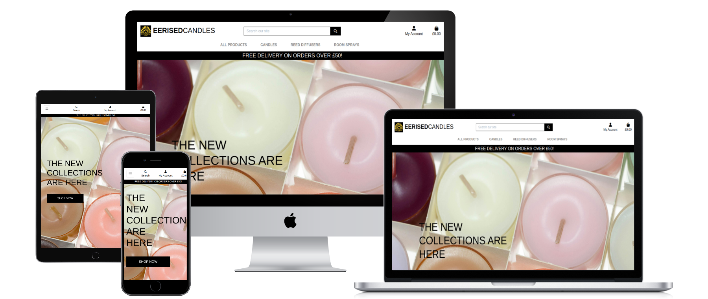

[View live website here](https://eerised-candles-d14b8af9df5f.herokuapp.com/)

## Table of Contents

- [User Experience (UX)](#user-experience-ux)
  - [Project Goals](#project-goals)
  - [User Stories](#user-stories)
  - [Design](#design)
- [Features](#features)
- [Database Schema](#database-schema)
- [Accessibility](#accessibility)
- [Manual Testing](#manual-testing)
  - [Features Testing](#features-testing)
  - [Browser Compatibility](#browser-compatibility)
  - [Responsiveness Testing](#responsiveness-testing)
  - [Code Validation](#code-validation)
  - [Bugs](#bugs)
  - [Lighthouse Testing](#lighthouse-testing)
- [Deployment](#deployment)
- [Technologies Used](#technologies-used)
- [Credits](#credits)

# User Experience (UX)

## Project Goals

- **Seamless Shopping Experience:** Create an e-commerce platform where users can easily browse, select, and purchase products.
- **Intuitive Navigation:** Design a clean and straightforward navigation system for easy access to all pages and products.
- **Mobile-First Design:** Ensure the site is fully responsive and performs smoothly across all screen sizes and devices.
- **Secure Transactions:** Integrate Stripe to provide a safe and reliable payment process for users.
- **User Account Management:** Allow users to register, log in, and manage their accounts, including order history, wishlist and reviews.
- **Product Management Tools:** Enable the site owner to add, update, and remove products, as well as manage inventory and pricing.
- **Wishlist Functionality:** Let users save favourite products to revisit or purchase later.
- **Review System:** Enable users to leave reviews and ratings to build community trust and help inform other shoppers.

## User Stories

- As a user, I can browse all available products so that I can decide which items I want to buy.
- As a user, I can securely make a payment through Stripe so that I can complete my purchase safely.
- As a user, I can create an account so that I can manage my orders, wishlist, and reviews.
- As a user, I can leave reviews on products so that I can share my experience and help others.

- As a site owner, I can list and sell products so that I can run an online store.
- As a site owner, I can manage inventory and pricing so that the product listings remain accurate and up-to-date.
- As a site owner, I can track customer orders and payments so that I can ensure fulfillment and resolve issues.
- As a site owner, I can process payments through Stripe so that I receive revenue securely.
- As a site owner, I can view and manage user reviews so that I can maintain the quality and trustworthiness of the site.

## Design

### Colour Scheme

EERISED Candles uses a minimal, bold colour palette:

- Black (#000000): Base colour used for depth and contrast
- White (#FFFFFF): Clean, neutral background and text
- Mustard (#F7CF48): Accent colour inspired by candlelight

This scheme reflects the brand’s warm, modern, and minimal aesthetic.

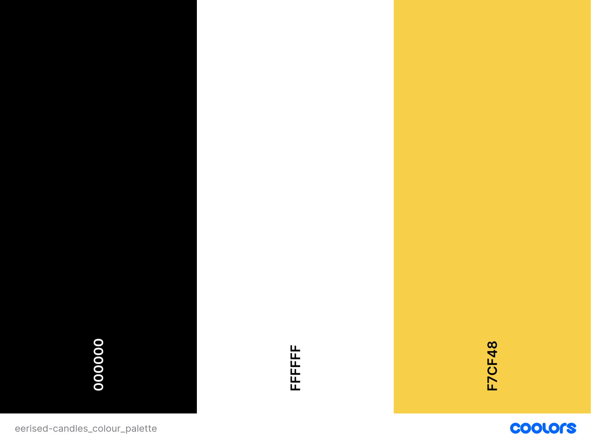

### Typography

The site uses the **Lato** typeface throughout. It’s clean, modern, and easy to read — aligning with the brand’s minimal aesthetic.

### Imagery

Imagery is warm and moody, focusing on candlelight, shadows, and natural textures. Photos are styled to reflect calm, comfort, and intentional living.

### Wireframes

The layout and structure of this website are based on the walkthrough project provided in the Code Institute's Level 5 Diploma in Web Application Development course - specifically, the "Project - Boutique Ado." Since the design was already established, I did not create separate wireframes for this project.

# Features

- **Product Browsing**  
  Users can easily browse through the available products, view detailed descriptions, images, and prices, and filter products based on categories or price range.

- **User Authentication**  
  Users can create an account and log in to manage their shopping cart, view past orders, and save personal preferences.

- **Shopping Cart**  
  Users can add products to their shopping cart, view the contents, and proceed to checkout when ready to purchase.

- **Stripe Payment Integration**  
  Payments are securely processed via Stripe, allowing users to complete transactions safely with credit/debit cards.

- **Order Confirmation**  
  After successful payment, users receive an order confirmation with details of their purchase and expected delivery.

- **Wishlist**  
  Users can save their favorite products to a wishlist for easy access and future purchases.

- **Product Reviews**  
  Users can leave ratings and reviews on products to share their experiences and help other shoppers make informed decisions.

- **Purchase History**  
  Logged-in users can view their past orders and payment history, making it easy to track previous purchases.

### Future Features

- **Product Recommendations:** Use browsing and purchase history to suggest products to users based on their preferences.
- **Social Media Integrations:** Allow users to share products, reviews, or their wishlist items on social media platforms (Instagram, Pinterest, etc.).
- **User Profile Customisation:** Allow users to customize their profiles with preferences, favourite scents, or styles, improving the overall user experience.
- **Gift Cards:** Add an option for users to purchase and redeem gift cards, which can be used towards future purchases on the site.
- **Subscription Service:** Offer a subscription model where users can receive regular deliveries of their favourite candles or reed diffusers at a discounted rate.

# Database Schema

The database stores all relevant data related to user accounts, products, orders, reviews, and wishlists. This includes user details, product information, order transactions, and customer feedback. Below is the Entity-Relationship Diagram (ERD), followed by a detailed description of the database tables and their relationships.

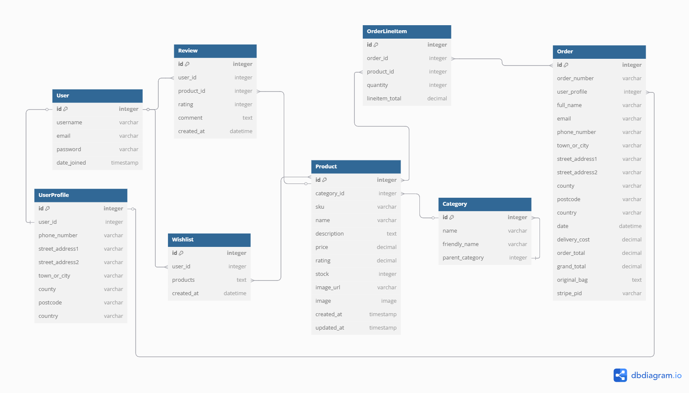

## Tables

### **User**

| Field         | Type      | Description                                      |
| ------------- | --------- | ------------------------------------------------ |
| `id`          | Integer   | Primary key                                      |
| `username`    | Varchar   | User's chosen username                           |
| `email`       | Varchar   | User's email address                             |
| `password`    | Varchar   | User's encrypted password                        |
| `date_joined` | Timestamp | Timestamp of when the user created their account |

### **UserProfile Table**

| Field             | Type    | Description                       |
| ----------------- | ------- | --------------------------------- |
| `id`              | Integer | Primary key                       |
| `user_id`         | Integer | Foreign key, references `User.id` |
| `phone_number`    | Varchar | User's phone number               |
| `street_address1` | Varchar | First line of the user's address  |
| `street_address2` | Varchar | Second line of the user's address |
| `town_or_city`    | Varchar | User's town or city               |
| `county`          | Varchar | User's county                     |
| `postcode`        | Varchar | User's postcode                   |
| `country`         | Varchar | User's country                    |

### **Category Table**

| Field             | Type    | Description                                                         |
| ----------------- | ------- | ------------------------------------------------------------------- |
| `id`              | Integer | Primary key                                                         |
| `name`            | Varchar | Name of the category                                                |
| `friendly_name`   | Varchar | A human-readable version of the category name                       |
| `parent_category` | Integer | A self-referential foreign key to allow for hierarchical categories |

### **Product Table**

| Field         | Type      | Description                                      |
| ------------- | --------- | ------------------------------------------------ |
| `id`          | Integer   | Primary key                                      |
| `category_id` | Integer   | Foreign key, references `Category.id`            |
| `sku`         | Varchar   | Stock keeping unit identifier for the product    |
| `name`        | Varchar   | Name of the product                              |
| `description` | Text      | Detailed description of the product              |
| `price`       | Decimal   | Price of the product                             |
| `rating`      | Decimal   | Average user rating of the product               |
| `stock`       | Integer   | Quantity of the product in stock                 |
| `image_url`   | Varchar   | URL of the product image                         |
| `image`       | Image     | Binary data for the product image                |
| `created_at`  | Timestamp | Timestamp of when the product was added          |
| `updated_at`  | Timestamp | Timestamp of the last update made to the product |

### **Order Table**

| Field             | Type     | Description                                        |
| ----------------- | -------- | -------------------------------------------------- |
| `id`              | Integer  | Primary key                                        |
| `order_number`    | Varchar  | Unique order number                                |
| `user_profile`    | Integer  | Foreign key, references `UserProfile.id`           |
| `full_name`       | Varchar  | Full name of the customer                          |
| `email`           | Varchar  | Customer's email                                   |
| `phone_number`    | Varchar  | Customer's phone number                            |
| `town_or_city`    | Varchar  | Delivery town/city                                 |
| `street_address1` | Varchar  | Delivery address line 1                            |
| `street_address2` | Varchar  | Delivery address line 2                            |
| `county`          | Varchar  | Delivery county                                    |
| `postcode`        | Varchar  | Delivery postcode                                  |
| `country`         | Varchar  | Delivery country                                   |
| `date`            | Datetime | Date and time the order was placed                 |
| `delivery_cost`   | Decimal  | Delivery charge                                    |
| `order_total`     | Decimal  | Total of all products in the order                 |
| `grand_total`     | Decimal  | Total including delivery cost                      |
| `original_bag`    | Text     | Original shopping cart content (serialized format) |
| `stripe_pid`      | Varchar  | Stripe payment identifier                          |

### **OrderLineItem Table**

| Field            | Type    | Description                                |
| ---------------- | ------- | ------------------------------------------ |
| `id`             | Integer | Primary key                                |
| `order_id`       | Integer | Foreign key, references `Order.id`         |
| `product_id`     | Integer | Foreign key, references `Product.id`       |
| `quantity`       | Integer | Quantity of the product in the order       |
| `lineitem_total` | Decimal | Total cost for this line item in the order |

### **Review Table**

| Field        | Type     | Description                              |
| ------------ | -------- | ---------------------------------------- |
| `id`         | Integer  | Primary key                              |
| `user_id`    | Integer  | Foreign key, references `User.id`        |
| `product_id` | Integer  | Foreign key, references `Product.id`     |
| `rating`     | Integer  | Rating given by the user (1-5 scale)     |
| `comment`    | Text     | Textual feedback from the user           |
| `created_at` | Datetime | Timestamp of when the review was created |

### **Wishlist Table**

| Field        | Type     | Description                                      |
| ------------ | -------- | ------------------------------------------------ |
| `id`         | Integer  | Primary key                                      |
| `user_id`    | Integer  | Foreign key, references `User.id`                |
| `products`   | Text     | A serialised list of product IDs in the wishlist |
| `created_at` | Datetime | Timestamp when the wishlist was created          |

# Accessibility

The website is designed with accessibility in mind, ensuring that all users, including those with visual impairments, can navigate and interact with it effectively. Key features include high color contrast between text and background, legible fonts (Lato), keyboard navigation support, descriptive alt text for all images, clear form labels, and accessible buttons and links. The site is also fully responsive, providing a seamless experience across different devices. These efforts ensure an inclusive and user-friendly environment for all visitors.

# Manual Testing

## Features Testing

|             Feature             |                              Test Case                              |                                              Outcome                                              |
| :-----------------------------: | :-----------------------------------------------------------------: | :-----------------------------------------------------------------------------------------------: |
|          Logo Display           |             Check if the logo is displayed on all pages             |                        Logo is visible at the top-left corner of the page                         |
|        Logo as Home Link        |                   Click on the logo from any page                   |                               Logo takes the user to the home page                                |
|         Navigation Bar          |      Ensure that the navigation bar is visible and accessible       |                      Navigation links are properly displayed and functional                       |
|      Logged-Out My Account      |              View the my account links when logged out              |                                Options include: Register and Login                                |
|      Logged-In My Account       |              View the my account links when logged in               |                              Options include: My Profile and Logout                               |
|  Logged-In My Account (Admin)   |          View the my account links when logged in as admin          |                    Options include: Product Management, My Profile and Logout                     |
|        Product Browsing         |                Browse products using navigation bar                 |                              All products are visible and accessible                              |
|      Sorting Functionality      |                            Sort products                            |                      All products can be sorted by name, price and category                       |
|         Product Details         |               Click on a product to view its details                |        Product detail page displays correct information (name, price, description, image)         |
|           Add to Cart           |       Add a product to the cart from the product detail page        |    Product is added to the cart and reflected in the cart page with correct quantity and total    |
|          Shopping Cart          |   View, update quantity, and remove items from the shopping cart    |             Cart updates correctly when items are added, quantity changed, or removed             |
|        User Registration        |          Register a new user with valid and invalid inputs          |                Account is created with valid data; errors shown for invalid inputs                |
|           User Login            |              Log in with valid and invalid credentials              |                      Redirect to home page on success; show error on failure                      |
|        Checkout Process         |              Complete a purchase using Stripe payment               |               Payment is successfully processed and order confirmation is received                |
|            Wishlist             |               Add and remove items from the wishlist                |                      Items are correctly added and removed from the wishlist                      |
|        Review Submission        |             Submit a product review as a logged-in user             |         Review is successfully submitted and displayed under the respective product page          |
|       Order Confirmation        |  Ensure that order confirmation is sent after a successful payment  |                 User receives a confirmation email with order details and status                  |
|      Search Functionality       |                Enter a search term in the search bar                |                     Products matching the search term are displayed correctly                     |
|        Responsive Design        |               Resize browser window or open on mobile               |           Layout adjusts and content is still usable and accessible on all screen sizes           |
|        Mobile Navigation        |           Navigate through the site using a mobile device           |                 All navigation links and buttons work correctly on mobile devices                 |
|         Form Validation         |              Submit forms with missing/invalid fields               |                       Shows validation errors for missing or invalid inputs                       |
|       Alt Text for Images       |                Check images for descriptive alt text                |                All product images and key visuals have alt text for screen readers                |
|       Keyboard Navigation       |       Navigate the site using only the keyboard (Tab, Enter)        |           All interactive elements (links, buttons, forms) are accessible via keyboard            |
|  Accessible Links and Buttons   |   Ensure all links and buttons have accessible, descriptive text    |  All links and buttons have meaningful text for users with screen readers or keyboard navigation  |
|    Product Stock Management     |           Check product availability after adding to cart           |       Stock is updated correctly after product is added to cart, preventing over-purchasing       |
|         Product Rating          |          Rate a product and check if the rating is updated          |               Product rating is successfully updated and displayed after submission               |
|   Stripe Payment Integration    |                 Complete a test payment via Stripe                  |                       Payment is processed securely and order is confirmed                        |
|           Pagination            |         Test if pagination works for long product listings          |               Products are split across pages and pagination links work as expected               |

## Browser Compatibility

| Browser Tested | Intended Appearance | Intended Responsiveness |
| :------------: | :-----------------: | :---------------------: |
|     Chrome     |        Good         |          Good           |
|     Safari     |        Good         |          Good           |
| Microsoft Edge |        Good         |          Good           |

## Responsiveness Testing

|    Device Tested    | Site responsive >= 700px | Site responsive < 699px> | Renders as expected |
| :-----------------: | :----------------------: | :----------------------: | :-----------------: |
|  iPhone 14 Pro Max  |           N/A            |           Good           |        Good         |
| Samsung Galaxy S8 + |           N/A            |           Good           |        Good         |
|      iPad Air       |           Good           |           N/A            |        Good         |
|   MacBook Air 13"   |           Good           |           N/A            |        Good         |
|     23" monitor     |           Good           |           N/A            |        Good         |

## Code Validation

### HTML Validator

To ensure the correctness of the HTML code, I used the W3C HTML Validator. The validation process revealed no errors in the HTML code across all pages of the website. This confirms that the HTML is properly structured and adheres to web standards.

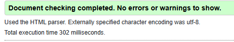

### CSS Validator

For CSS validation, I utilised the W3C CSS Validator. The CSS code was thoroughly checked, and no errors were found. This indicates that the CSS is correctly formatted and conforms to the established CSS standards.

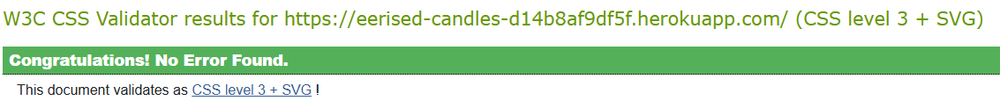

## Bugs

### Update Button Not Submitting Form

The update buttons on the shopping bag page were not working due to a bug in the JavaScript that relied on the DOM structure to locate and submit the correct form. Specifically, it used `.closest('.row')` to find the associated `.update-form`, but after changes to the HTML layout, the form was no longer within the same `.row`, resulting in `form.submit()` not being triggered. This prevented users from updating item quantities in their bag. To fix the issue, the code was refactored to use a `data-target` attribute on each update button, pointing to the `id` of the corresponding form. The click handler then uses this attribute to directly select and submit the form, removing any dependency on the surrounding HTML structure. As a result, the update functionality now works reliably across all screen sizes and layouts.

### Update and Remove Buttons Not Aligned Horizontally on Larger Screens

The bug involved the "Update" and "Remove" buttons not staying aligned horizontally on larger screens. They were placed inside a container with Bootstrap grid classes (`col-12 col-sm-6`), but this setup caused them to stack vertically rather than appearing side by side. This misalignment affected the layout by creating an inconsistent user interface, potentially confusing users about the relationship between the buttons and the associated item. To fix the issue, the buttons were wrapped in a `div` with responsive grid classes (`col-12 col-sm-6 col-md-12 col-lg-12`) and utility classes (`d-flex justify-content-between`) to enforce a horizontal layout using Flexbox. Additionally, `float-right` was applied to the `.remove-item` class to ensure it aligned correctly within the container. As a result, the buttons now display side by side across all screen sizes, resolving the layout issue and improving the overall user experience.

### Update Button in Shopping Bag Not Working

There was a bug where clicking the "Update" link in the shopping bag did not adjust the product quantity as expected. This was because the link's default behavior—navigating to a new page—was preventing the form from submitting properly. As a result, users were unable to update item quantities in their cart, which could lead to frustration and abandoned purchases. To fix the issue, `e.preventDefault()`; was added to the JavaScript click event handler for the "Update" link. This prevented the default link behavior and allowed the form to submit correctly. After applying the fix, the issue was resolved and users can now successfully update item quantities in their shopping bag.

## Lighthouse Testing

I used Lighthouse to audit the performance and quality of this website on desktop and mobile.

### Home Page

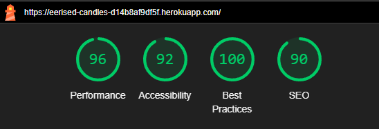
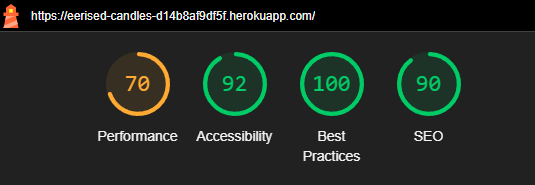

### All Products Page

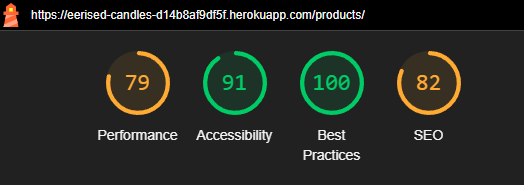
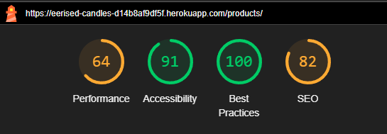

### Product Detail Page

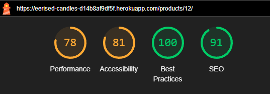
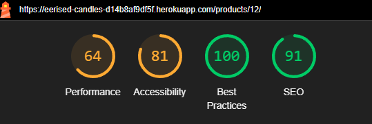

### My Profile Page

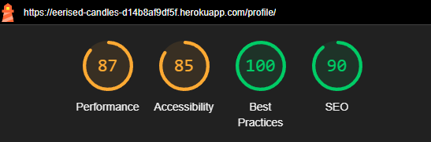
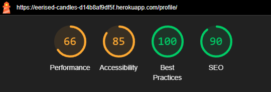

### Product Management Page

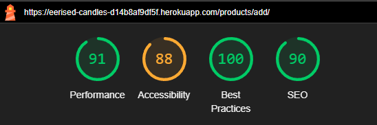
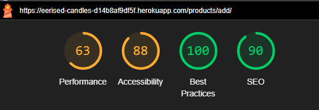

### Shopping Bag Page

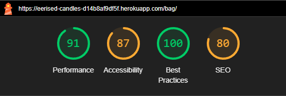
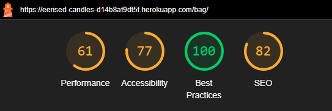

# Deployment

## Local Deployment

1. Clone the repository:

```
git clone https://github.com/desireealexia/eerised-candles.git
cd eerised-candles
```

2. Create and activate a virtual environment:

```
python -m venv venv
source venv/bin/activate # On Mac
venv\Scripts\activate # On Windows
```

3. Install the required dependencies: `pip install -r requirements.txt`
4. Set up the database: `python manage.py migrate`
5. Run the development server: `python manage.py runserver`

Your app should now be running locally at `http://127.0.0.1:8000/`.

## Heroku Deployment

1. Install the Heroku CLI if you haven't already.
2. Log in to Heroku: `heroku login`
3. Create a new Heroku app: `heroku create`
4. Push your code to Heroku: `git push heroku main`
5. Set up the Heroku database: `heroku run python manage.py migrate`
6. Open your deployed app: `heroku open`

Your app should now be live on Heroku!

# Technologies Used

## Languages Used

- HTML/CSS
- JavaScript
- Python
- SQL

## Frameworks, Libraries & Tools

- Django with Django Allauth, SummerNote and Crispy Forms
- PostgreSQL Database
- Bootstrap
- Stripe
- Font Awesome
- Git/GitHub
- Heroku (deployment)
- AWS
- Canva

# Credits

## Code

Most of the code for this project comes from the walkthrough project provided in the Code Institute's Level 5 Diploma in Web Application Development course. The structure, functionality, and general flow of the site were inspired by this project.

## Content

The content on the website, including text and product descriptions, is sourced directly from the EERISED Candles brand. However, product descriptions and customer reviews were generated using **ChatGPT** to assist in content creation.

## Media

- All images of the **EERISED Candles** products were provided by the brand.
- The main image used on the index page was sourced from [Pixabay](https://www.pexels.com/photo/assorted-color-pillar-candles-33197/) and is credited to the photographer.
